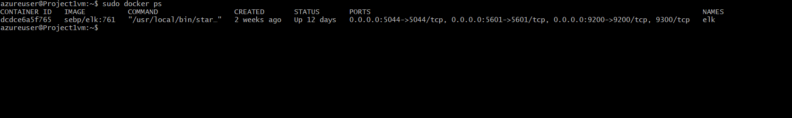

# Elk-Config-Project
## Automated ELK Stack Deployment

The files in this repository were used to configure the network depicted below.

These files have been tested and used to generate a live ELK deployment on Azure. They can be used to either recreate the entire deployment pictured above. Alternatively, select portions of the filebeat-playbook.yml file may be used to install only certain pieces of it, such as Filebeat.

  [My_Playbook](Ansible/my_playbook.yml)
  
  [Filebeat_Metricbeat](Ansible/filebeat_metricbeat_playbook.yml)
  
  [Elk_Playbook](Ansible/elkplaybook.yml) 
  

This document contains the following details:
- Description of the Topology
- Access Policies
- ELK Configuration
  - Beats in Use
  - Machines Being Monitored
- How to Use the Ansible Build

### Description of the Topology

The main purpose of this network is to expose a load-balanced and monitored instance of DVWA, the D*mn Vulnerable Web Application.

- What aspect of security do load balancers protect?

Load balancing ensures that the application will be highly protected from DDOS attacks, in addition to restricting unwanted connections to the network. This is done by evenly distrubing network traffice to prevent a server or resource from being overloaded. The Web Application Firewall of the load balancer protects the environment from attackers by creating rules and a daily rule can be created in order to stay updated on the latests threats.

- What is the advantage of a jump box?

Before explaining the advantage of having a jump box, I'll give a quick summary of what a jump box is. A jump box, also known as a jump server, is a secure server that requries all system adminstrators to first connect to before luanching any administrative task or use as on origination point to connect to other servers or untrusted environments. The advantage of a jump box are that a user's workstation and the privileged assets within the network are separated.

Integrating an ELK server allows users to easily monitor the vulnerable VMs for changes to the log data and system metrics and statistic.
- What does Filebeat watch for?

Filebeat is a lightweight shipper for forwarding and centralizing log data. Installed as an agent on your servers, Filebeat monitors the log files or locations that you specify, collects log events, and forwards them either to Elasticsearch or Logstash for indexing.

- What does Metricbeat record?

Metricbeat is a lightweight shipper that you can install on your servers to periodically collect metrics from the operating system and from services running on the server. Metricbeat takes the metrics and statistics that it collects and ships them to the output that you specify, such as Elasticsearch or Logstash.

The configuration details of each machine may be found below.

| Name     | Function | IP Address | Operating System |
|----------|----------|------------|------------------|
| Jump Box | Gateway  | 10.1.0.4 52.168.139.124   | Linux            |
|Project-1 |  ELK Server    | 10.0.0.4   | Linux            |
| Web-1    |  Web Server Running DVWA        | 10.1.0.9   | Linux            |
| Web-2    |  Web Server Running DVWA        | 10.1.0.8   | Linux            |

### Access Policies

The machines on the internal network are not exposed to the public Internet. 

Only the Jump Box machine can accept connections from the Internet. Access to this machine is only allowed from the following IP addresses:
Only my Admin Personal IP address was whitelisted to connect to the jump box.

Machines within the network can only be accessed by Web-1 and Web-2:
The Jump Box(IP address 10.1.0.4) was the only machine allowed access to Web-1 and Web-2.

A summary of the access policies in place can be found in the table below.

| Name     | Publicly Accessible | Allowed IP Addresses |
|----------|---------------------|----------------------|
| Jump Box | Yes                  | Admin Personal IP
| Web-1    | No                  | 10.0.0.4                     |
| Web-2    | No                  | 10.0.0.4                     |
| Project-1| Yes                 | 52.168.139.124 10.1.0.4 |
### Elk Configuration

Ansible was used to automate configuration of the ELK machine. No configuration was performed manually, which is advantageous because tasks that are either cumbersome or repetitive or complex can be done through simple YAML file.
- What is the main advantage of automating configuration with Ansible?

The main advantage that Anisble brings is automation of and simpliplification of repetative, complex, and tedious operations. This creates fewer user errors and ease of installing the YAML file on any machine.

The playbook implements the following tasks:

-  Install docker.io
-  Install python3-pip
-  Install Docker module
-  Enable Docker Service

The following screenshot displays the result of running `docker ps` after successfully configuring the ELK instance.

### Target Machines & Beats
This ELK server is configured to monitor the following machines
- Web-1 10.1.0.9
- Web-2 10.1.0.8
We have installed the following Beats on these machines:
- Filebeat and Metricbeat

These Beats allow us to collect the following information from each machine: 
- Filebeat will collect data such as 'SSH logins' which will allow us to view SSH login attemps and see how many were successful.
- Metricbeat will collect system metrics such as CPU usage and can be used to examine inconsistencies.

### Using the Playbook
In order to use the playbook, you will need to have an Ansible control node already configured. Assuming you have such a control node provisioned: 

SSH into the control node and follow the steps below:
- Copy the elkplaybook.yml file to /etc/ansible.
- Update the /etc/ansible/hosts file to include the private IP of Project-1 (10.0.0.4) to the ElasticSearch and Kibana sections of the configuration file.
- Run the playbook, and navigate to Project-1 VM via SSH to check that the installation worked as expected.
